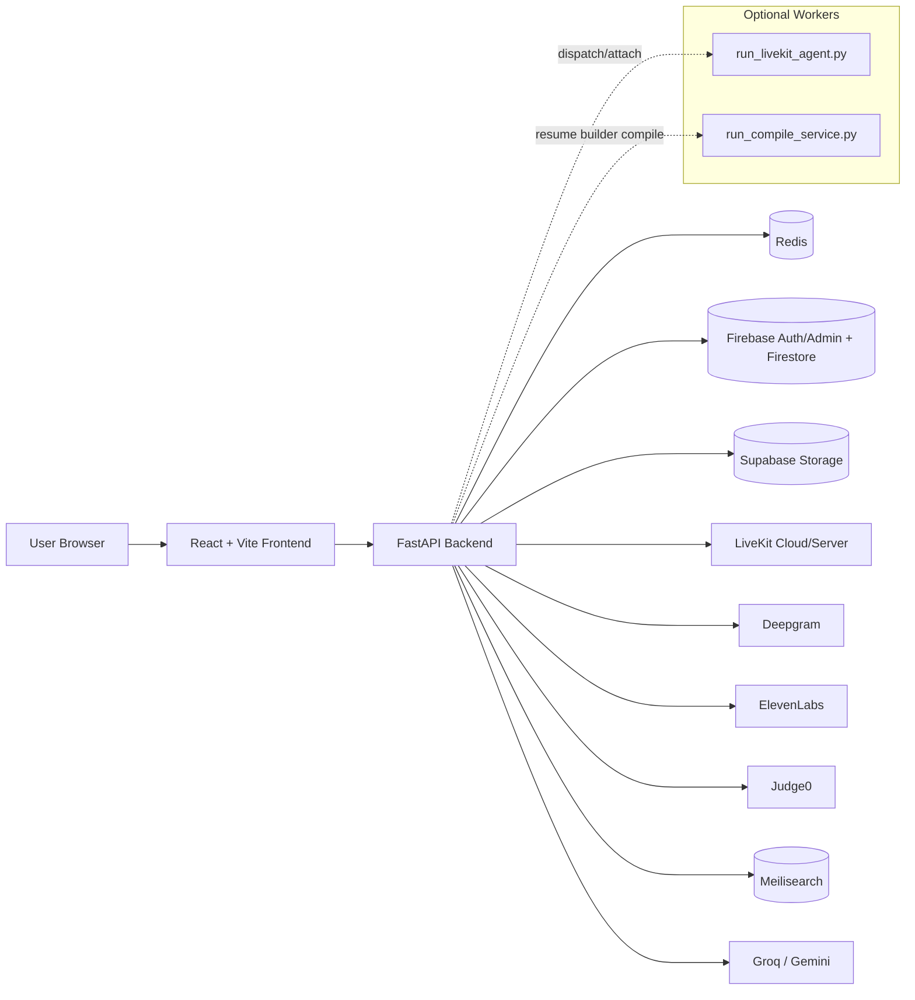

# Vetta.ai

Vetta.ai is a full-stack interview preparation and career-intelligence application built with a **FastAPI backend** and **React + Vite frontend**. It combines live AI interview sessions, resume version management, fit analysis against job descriptions, and profile/readiness intelligence into one authenticated user workflow.

> **Scope note:** this README documents what is implemented in the repository today. For broader product vision and future direction, see `product.md` (aspirational context, not source-of-truth for current behavior).

---

## Detailed overview

Vetta.ai is designed for candidates who want to improve interview performance and iterate on their job-application materials with measurable feedback.

In practice, the main user loop is:

1. Sign in and maintain profile/career preferences.
2. Upload resumes into Resume Vault (with versions and metadata).
3. Run **Application Fit** and **Signal Intelligence** against target roles/JDs.
4. Start mode-specific interview sessions (role-targeted, resume deep-dive, pair-programming).
5. Review history, feedback, and extracted profile claims to improve future sessions.

The app supports both voice interview transport modes:
- **LiveKit path** (when configured), and
- **WebSocket fallback path** (`/ws/interview/...`) when fallback is enabled and LiveKit is unavailable.

Some areas are intentionally feature-gated (disabled by default in example envs), especially **Job Discovery** and **Resume Builder**.

---

## Tech stack (implemented)

### Frontend (`frontend/`)
- React 19 + TypeScript
- Vite 7
- React Router 7
- TanStack React Query
- Firebase client SDK
- Framer Motion
- react-hot-toast
- Sentry (`@sentry/react`)
- Monaco editor (pair-programming coding UI)
- Vitest + Testing Library + Playwright

### Backend (`backend/`)
- Python 3.11
- FastAPI + Uvicorn
- Pydantic + pydantic-settings
- Redis
- Firebase Admin
- Supabase SDK
- Meilisearch SDK
- LiveKit agents stack
- Groq and Google Generative AI clients
- Deepgram (STT), ElevenLabs + Edge TTS (TTS)
- Judge0 integration (coding interview execution)
- PyMuPDF / PyPDF2 / python-docx (resume/JD parsing)
- Sentry SDK
- pytest / pytest-asyncio / fakeredis

---

## System architecture

### Runtime architecture (high-level)



### Frontend provider tree

From `frontend/src/index.tsx`:

```text
React.StrictMode
└─ AuthProvider
   └─ QueryProvider
      └─ BrowserRouter
         └─ BackendHealthProvider
            └─ ConfirmDialogProvider
               └─ App
```

- Sentry initializes only when `VITE_SENTRY_DSN` is set.
- `App.tsx` mounts website/auth/app/legacy route groups and global toast/error boundaries.

### Frontend route organization

- `frontend/src/routes/websiteRoutes.tsx`: `/`, `/contact`, `/pricing`, plus hash redirects (`/docs`, `/privacy`, `/terminal`).
- `frontend/src/routes/authRoutes.tsx`: `/signin`, `/signup`, `/verify-email`.
- `frontend/src/routes/appRoutes.tsx`: authenticated app surface:
  - dashboard, profile preferences/account
  - application fit + fit history
  - signal intelligence
  - AI interview hub + mode setup routes
  - interview room `/interview/:sessionId`
  - resume vault hub/library/compare/version detail
  - feature-gated `/jobs`, `/jobs/saved`, `/resume-vault/builder`

### Backend startup and router wiring

`backend/main.py`:
- loads settings from `backend/config.py`
- configures CORS + exception handlers + access logging
- validates Redis connectivity on startup
- logs configured service status (LLM/STT/TTS/Judge0/LiveKit)
- optionally embeds LiveKit agent when `LIVEKIT_AGENT_EMBEDDED=true`
- mounts websocket fallback router when `INTERVIEW_WEBSOCKET_FALLBACK_ENABLED=true`
- registers routers:
  - `vault`, `application_fit`, `signal`, `job_discovery`, `career_preferences`, `user_account`, `livekit`, `resume_builder`, `contact`, `interview`
- exposes `/` and `/health`

### How external services fit the system

- **Redis**: interview session state/TTL and rate limiting.
- **Firebase**: identity token verification and user-scoped data paths.
- **LiveKit**: real-time interview transport; token minting and worker dispatch via `/livekit/*`.
- **Deepgram**: speech-to-text for live interview flow/fallback path.
- **ElevenLabs / Edge TTS**: AI voice output providers.
- **Judge0**: executes submitted coding answers in pair-programming mode.
- **Supabase**: optional vault file storage backend (fallback local storage exists).
- **Meilisearch**: job discovery search index backend when job discovery is enabled.

### Optional services/workers

- **LiveKit agent worker**: `backend/run_livekit_agent.py` (recommended separate process in dev; embedded mode is optional).
- **Resume compile service**: `backend/run_compile_service.py` serves `services.resume_builder.compile_app:app` on port 8001 for Resume Builder preview/publish.

---

## Features (implemented product areas)

### 1) AI Interview modes and session flow

Implemented API/session flow:
- Start: `POST /interview/start`
- Live room: `/interview/:sessionId` (frontend) with LiveKit or WebSocket transport
- Code execution (coding sessions): `POST /interview/submit-code`
- Complete + feedback: `POST /interview/complete`
- History/session retrieval/deletion: `/interview/history`, `/interview/session/{id}`

Implemented mode catalog (`features/interview/domain/modeContract.ts`):
- **Role-Targeted** (live)
- **Resume Deep-Dive** (live)
- **Pair Programming** (live, coding-capable)
- **Pressure Mode** (UI route exists, marked coming-soon / not live-startable)
- **Blind Mode** (UI route exists, marked coming-soon / not live-startable)

### 2) Resume Vault

Implemented vault capabilities:
- upload resumes (`/vault/upload`) with metadata
- list/edit/delete entries (`/vault`, `/vault/{resume_id}`)
- set active resume (`/vault/{resume_id}/set-active`)
- version listing/detail (`/versions`, `/versions/{version_id}`)
- file retrieval (`/vault/files/{version_id}`)
- restore old version into active flow (`/restore/{version_id}`)
- analyze a version (`/analyze`)
- compare two resumes/versions (`/compare`) with report-oriented UI

Frontend includes:
- hub (`/resume-vault`)
- library (`/resume-vault/library`)
- version list/detail (`/resume-vault/r/:resumeId`, `/resume-vault/r/:resumeId/:versionId`)
- compare workspace/result (`/resume-vault/compare`, `/resume-vault/compare/result`)

### 3) Application Fit + history

- Compute fit: `POST /application-fit/compute`
- Role-scoped history: `GET /application-fit/history`
- Snapshot retrieval: `GET /application-fit/snapshots/{snapshot_id}`
- JD text extraction upload: `POST /application-fit/extract-text`

Frontend surfaces a setup/report flow and a dedicated history page.

### 4) Signal Intelligence

- Readiness scoring: `POST /signal/readiness/compute`
- Readiness history: `GET /signal/readiness/history`
- Profile claims APIs (under interview router):
  - list, per-session view
  - accept/reject/bulk actions
  - profile-memory summary timeline

Frontend page combines:
- readiness panel
- claims inbox moderation
- profile-memory timeline view

### 5) Profile, career preferences, account management

- Career preferences read/update: `GET/PATCH /career-preferences`
- Account deletion/purge: `DELETE /user/account` (explicit confirmation required)
- Frontend account settings include display/profile controls, verification/reset helpers, interview behavior preference, and destructive account actions.

### 6) Contact form

- Public endpoint: `POST /contact`
- Optional authenticated context (if bearer token present)
- Rate-limited and resilient to unauthenticated submissions from website contact page.

### 7) Feature-flagged / gated areas

Disabled by default in `.env.example` and `frontend/.env.example`:

- **Job Discovery**
  - frontend routes: `/jobs`, `/jobs/saved` (rendered only when `VITE_JOB_DISCOVERY_ENABLED=true`)
  - backend router: `/jobs/*` (requires backend enablement and Meilisearch/config)

- **Resume Builder**
  - frontend route: `/resume-vault/builder` (rendered only when `VITE_RESUME_BUILDER_ENABLED=true`)
  - backend router: `/resume-builder/*` (returns disabled/not-found behavior when off)
  - requires compile service for preview/publish operations

---

## Local setup and run guide

## 1) Root env setup

From repo root:

```bash
cp .env.example .env
cp frontend/.env.example frontend/.env
```

Then fill credentials and service URLs needed for the features you plan to run.

## 2) Backend setup

```bash
cd backend
python -m venv .venv
source .venv/bin/activate
pip install -r requirements.txt
uvicorn main:app --reload --host 0.0.0.0 --port 8000
```

Alternative entrypoint:

```bash
python main.py
```

## 3) Frontend setup

```bash
cd frontend
npm install
npm run dev
```

Useful frontend scripts (`frontend/package.json`):
- `npm run dev`
- `npm run build`
- `npm run preview`
- `npm run test`
- `npm run test:watch`
- `npm run test:e2e`
- `npm run check:no-js`
- `npm run check:imports`
- `npm run check:structure`

## 4) Optional: LiveKit agent worker

Run separately from `backend/`:

```bash
python run_livekit_agent.py dev
```

Use this when LiveKit is configured and `LIVEKIT_AGENT_EMBEDDED=false` (default in env example).

## 5) Optional: Resume compile service

Run from `backend/`:

```bash
python run_compile_service.py
```

This starts the compile app on `:8001` for Resume Builder preview/publish operations.

## 6) Docker Compose usage and caveats

```bash
docker compose up --build
```

Current `docker-compose.yml` defines:
- `backend` on `8000`
- `redis` on `6379`
- `frontend` on `3000`

Important caveats:
- frontend service references `frontend/Dockerfile`; verify/add that file in your branch/environment before relying on compose frontend build.
- Compose file does not include Meilisearch or compile-service containers; run those separately if enabling dependent features.
- Env values still come from `.env`/`frontend/.env`; compose does not remove external API credential requirements.

---

## Configuration reference

Copy templates:
- backend/runtime: `.env.example` → `.env`
- frontend runtime: `frontend/.env.example` → `frontend/.env`

### A) Core required (minimum app boot + auth + interview APIs)

Backend (typical minimum):
- `JWT_SECRET_KEY`
- `ALLOWED_ORIGINS` (and optional `ALLOWED_ORIGIN_REGEX`)
- `FIREBASE_PROJECT_ID`
- `FIREBASE_CREDENTIALS_PATH`
- `REDIS_HOST`, `REDIS_PORT`, `REDIS_PASSWORD`
- LLM credentials (`LLM_PROVIDER` + corresponding key such as `GROQ_API_KEY` or `LLM_API_KEY`)
- `DEEPGRAM_API_KEY` (needed for websocket fallback interview path)

Frontend:
- `VITE_API_URL`
- Firebase web config (`VITE_FIREBASE_*`)

### B) Core behavior toggles

Backend:
- `INTERVIEW_WEBSOCKET_FALLBACK_ENABLED`
- `REQUIRE_EMAIL_VERIFIED`
- `EXPOSE_API_ERRORS`
- `RATE_LIMIT_FAIL_OPEN`
- `TRUST_PROXY_HEADERS`, `TRUSTED_PROXY_IPS`

Frontend:
- `VITE_WS_URL`
- `VITE_REQUIRE_EMAIL_VERIFICATION`

### C) Live interview transport options

Backend:
- `LIVEKIT_URL`, `LIVEKIT_API_KEY`, `LIVEKIT_API_SECRET`
- `LIVEKIT_AGENT_EMBEDDED`

Frontend:
- `VITE_USE_LIVEKIT`
- `VITE_LIVEKIT_URL`

### D) Resume Vault and storage

Backend:
- `SUPABASE_URL`
- `SUPABASE_SERVICE_ROLE_KEY`
- `SUPABASE_VAULT_BUCKET`
- `VAULT_STORAGE_DIR` (local fallback path)

### E) Application Fit / Signal / profile intelligence

Backend:
- `APPLICATION_FIT_ENABLED`
- `JD_FIT_SEMANTIC_ALIGNMENT_ENABLED`
- `VPM_ENABLED`

### F) Job Discovery (optional, gated)

Backend:
- `JOB_DISCOVERY_ENABLED`
- `FANTASTIC_JOBS_API_KEY`, `FANTASTIC_JOBS_BASE_URL`
- `JOB_DISCOVERY_INGEST_PROVIDER`
- `MEILISEARCH_URL`, `MEILISEARCH_MASTER_KEY`

Frontend:
- `VITE_JOB_DISCOVERY_ENABLED`

### G) Resume Builder (optional, gated)

Backend:
- `RESUME_BUILDER_ENABLED`
- `COMPILE_SERVICE_URL`, `COMPILE_SERVICE_TOKEN`
- `TYPST_BIN`
- `APIFY_API_TOKEN` (for LinkedIn import path)

Frontend:
- `VITE_RESUME_BUILDER_ENABLED`

### H) Speech + coding integrations (optional but implemented)

Backend:
- `ELEVENLABS_API_KEY`
- `TTS_PROVIDER` (+ Edge TTS voice/rate/pitch vars)
- `JUDGE0_API_KEY`, `JUDGE0_HOST`

### I) Observability

Backend:
- `SENTRY_DSN`

Frontend:
- `VITE_SENTRY_DSN`

---

## Repository structure map

```text
Vetta.ai/
├─ backend/
│  ├─ main.py                       # FastAPI app startup, lifespan, middleware, router wiring
│  ├─ config.py                     # Pydantic settings / env model
│  ├─ requirements.txt              # Backend dependency set
│  ├─ run_livekit_agent.py          # LiveKit worker entrypoint
│  ├─ run_compile_service.py        # Resume compile-service entrypoint
│  ├─ routes/                       # API routers (interview, vault, fit, signal, jobs, etc.)
│  ├─ services/                     # Domain services and provider integrations
│  ├─ utils/                        # Auth, logging, redis, rate-limit, error utilities
│  ├─ models/                       # Shared backend API/data models
│  ├─ templates/                    # Resume-builder templates/assets
│  └─ data/                         # Local runtime storage fallback paths
├─ frontend/
│  ├─ src/index.tsx                 # App bootstrap + provider composition + optional Sentry init
│  ├─ src/App.tsx                   # Route composition + app shell wrappers + global toaster
│  ├─ src/routes/*.tsx              # Website/auth/app route groups + redirects
│  ├─ src/features/                 # Feature domains (modes, interview, vault, fit, signal, user, ...)
│  ├─ src/shared/                   # Shared contexts, query layer, UI, HTTP service helpers
│  ├─ package.json                  # Frontend scripts and dependencies
│  └─ vite.config.ts                # Vite plugins, aliases, chunk strategy
├─ .env.example                     # Backend/runtime env template
├─ frontend/.env.example            # Frontend env template
├─ docker-compose.yml               # Local multi-service orchestration
└─ product.md                       # Product vision (aspirational), not implementation truth
```

---

## Product brief vs implementation truth

- `product.md` describes long-range product vision and market narrative.
- For implemented behavior, treat code and this README as source of truth.
- When in doubt, verify against:
  - backend router files under `backend/routes/`
  - frontend route composition in `frontend/src/routes/`
  - environment templates (`.env.example`, `frontend/.env.example`)

